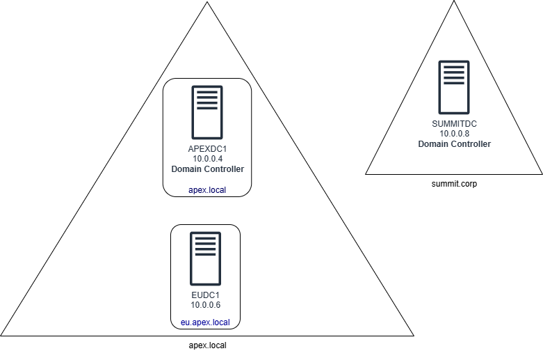

[Back to lesson page](README.md)

## Lab Deployment
See the [/deployment_guide.md](../../../deployment_guide.md) for instructions on deploying the environments with terraform or the GUI. This guide has instructions for locating your `azure_subscription_id` or public IP address if needed.

Use the terraform directory to deploy with terraform.

Use this button to deploy with the GUI:

> [!CAUTION]
> Do not forget to run `terraform destroy` or to delete the resource group with your lab resources when you are finished!
>
> VMs are cheap to run for a couple hours but quickly become expensive if they are left running.

### Lab Information

> - The default username to connect is `lab_admin`
> - You will be prompted for the password to set
> - These credentials will not work after you promote the domain controllers, you will need to use domain admin credentials to connect after promotion.

> - There are three servers in this lab:
>     - APEXDC1 10.0.0.4: A domain controller running the apex.local domain
>     - EUDC1 10.0.0.6: A default windows server
>     - SUMMITDC 10.0.0.8: A domain controller running the summit.corp domain

**Lab Diagram:**

# Lab Scenarios

## Configure a Forest and a transitive, one-way trust
Scenario: You are an administrator at Apex International. Your legal department wants to segregate the European division into it's own authentication and administrative boundary. You still need to maintain the ability for central IT administrators to manage servers if needed. You must configure an eu child domain and validate that there is a group in the child domain that contains the server administrators from the parent. (Your administrator accounts have a '-ADM' suffix and are located in the People/Admins OU.)

Apex International has also acquired the Summit Corporation. Your IT team needs to be able to manage the `summit.corp` domain to facilitate the technical transition using their `apex.local` accounts. The IT team from Summit does not require any access to the Apex domain.

### Completion Criteria
To complete this lab you should have the following criteria configured:
- The `apex.local` forest should have two domains; `apex.local`, and `eu.apex.local`
- You should be able to log into the `summit.corp` domain with users from both `apex.local` and `eu.apex.local`
- You should not be able to log into either `apex.local` domains using a `summit.corp` user

### Lesson Objectives Covered:
- Configure and manage forest and domain trusts