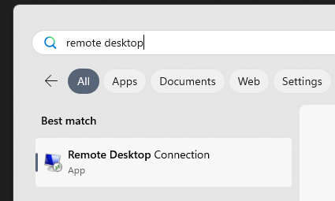
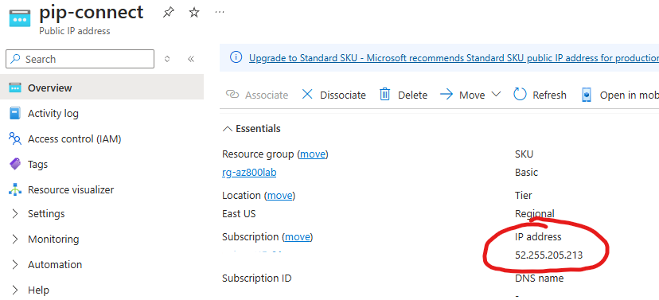
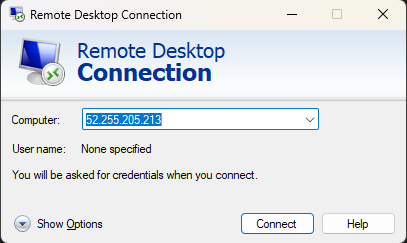
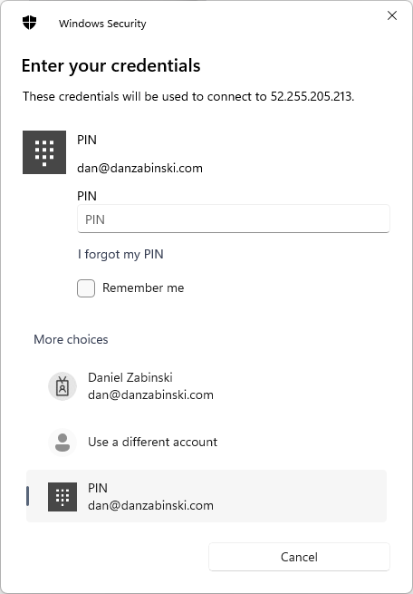
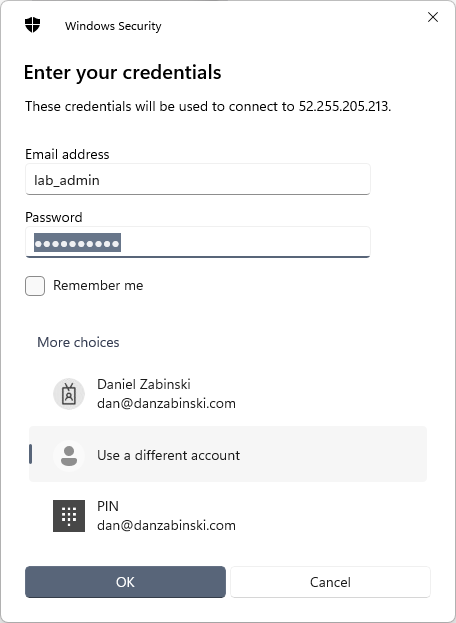

# Connection Guide
To connect to a lab environment after it's been deployed:

1. Open Remote Desktop

2. Enter the Public IP of your lab environment. This IP will be listed after running `terraform apply`, otherwise you can open the [azure portal](https://portal.azure.com) and search for `pip-connect`, this will display the Public IP that was created and you can copy the IP address from the resource.

3. When prompted for credentials, select "More choices > Use a different account" and type in the credentials specified in the lab instructions

## Credentials
- If the lab deployment creates servers that are not joined to the domain, the default username will be `lab_admin` (unless you specify otherwise).
- If you are connecting to a Domain Controller, you must use the domain admin credentials that you set up. (You cannot log into a DC with a local user.)
- You will always be prompted for a password, all users created by the deployment will use this same password.

## Troubleshooting
To keep things simple, when I deploy a lab environment I create and assign a public IP address to a lab server. I then create a network security group and set a rule that allows RDP connections from your public IP address.*

There are a few reasons you may not be able to connect:
1. Incorrect credentials, check the notes on the lab scenarios page or see the credentials section above.
1. You supplied the incorrect public IP during deployment. You can search for "network security groups" in the portal, locate the one for your lab and manually edit it to fix the IP. Otherwise, destroy and recreate the lab. Review the [deployment guide](deployment_guide.md) for more instructions.

> \* Please note, this configuration is not best practice. It's quick, easy and inexpensive for temporary lab environments but should not be configured for any production workloads.