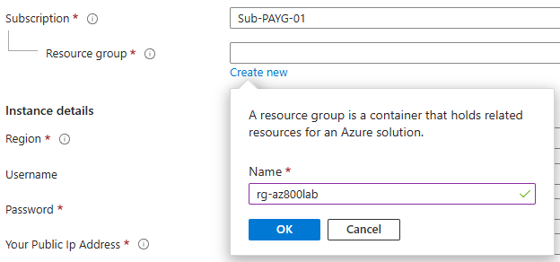
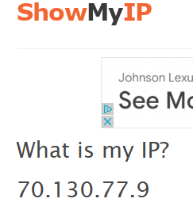
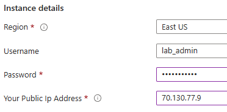

# Deployment Guide
For instructions on how to connect to a lab environment once it's deployed, see the [connection guide](connection_guide.md).

This document has general instructions for how to deploy the lab environment. If possible, I am going to try and have two options available:

1. A quick deploy button you can use which will launch Azure and allow you to enter parameters and deploy via the portal
1. A terraform directory which will allow you to deploy using terraform.

**I recommend using terraform to deploy labs if you are comfortable**. There are a few reasons I make this recommendation:

- Terraform or IaC is an industry standard for managing cloud resources. It is beneficial for your career to be familiar with it.
- You can use it to deploy resources and also to destroy them when you are finished with a single command, this is a little easier then deleting them in the portal and ensures anything terraform created was also destroyed so you're not paying for it
- You can make modifications to the terraform files if you want. The GUI deployment uses ARM templates which are hard coded and can't be edited.

As I am building content, I am always going to write the terraform labs first. Even when you are generating ARM templates automatically from a live environment, they are a pain to write and don't usually work without troubleshooting. Because of this, the GUI deployment may or may not be available depending on the time I have for setup.

## Deploying the labs with Terraform
You can use the [getting started guide](https://developer.hashicorp.com/terraform/tutorials/azure-get-started) from Terraform if you are completely new. You have to deploy terraform using a CLI, here is the general process:

1. Navigate to the `/terraform` directory in this repo for the lab you want to deploy. For example, if you are in the root `az800` folder and wanted to deploy the first lesson lab you would use `cd 1-ADDomainServices\1-BuildDCs\terraform` to navigate to the folder
1. Run `terraform init` to prep terraform and download the necessary config files
1. (Optional) run `terraform plan`, this will generate a plan and tell you what is going to be created
1. Run `terraform apply`, you will be prompted for any required inputs
1. The terraform output will list a public IP address, you can use RDP to connect to that address and sign into your lab server.
1. **Important:** When you are finished with your lab, run `terraform destroy` and validate it runs successfully.
1. When you are finished you can delete the `.terraform` directory and the `terraform.tfstate` files that were automatically created during the previous steps.

### Azure Subscription ID

The `terraform apply` command will always prompt you for an `azure_subscription_id`. This is the ID of the Azure subscription you are deploying resources to. To get the id, navigate to the [azure portal](https://portal.azure.com) and search for "subscriptions". This will take you to a page that lists your subscriptions and their IDs, copy/paste the associated ID from this page.

If you don't want to be prompted you can always add a default value to the `variable "azure_subscription_id" {}` block with the ID. This is what that would look like:

``` hcl
# Replace variable "azure_subscription_id" {} block with:
variable "azure_subscription_id" {
  default = "my_sub_id"
  type = "string"
}
```

## Using the GUI Template
Click the "Deploy to Azure" button and you will be redirected to your Azure portal to deploy the environment.

**When prompted, create a new resource group for your lab deployments.** If you deploy everything to a new resource group, then you can just delete that resource group when you are done with the lab to ensure you are no longer paying for them.



You will also need your public IP for one of the inputs, you can get it by visiting [showmyip.com](https://www.showmyip.com/). Just copy/paste the IP address into the field. This is used to create a security rule to allow you to RDP into the VM after it's created.





Enter any other required inputs and deploy the resources.